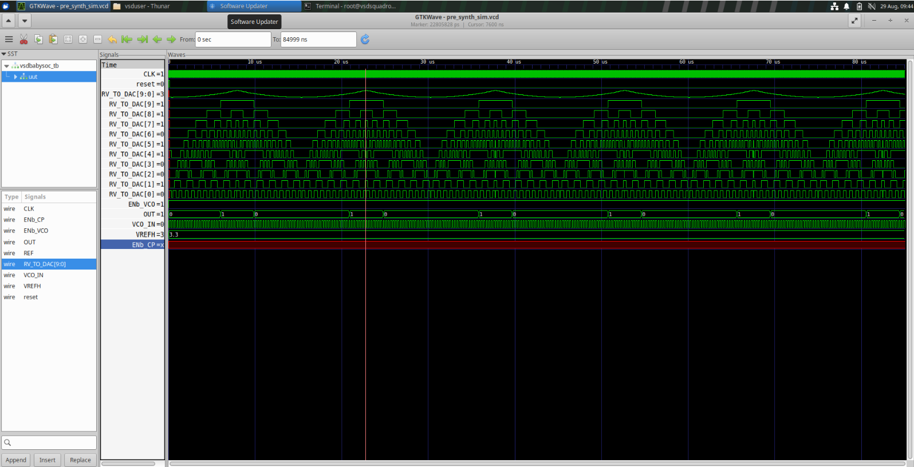
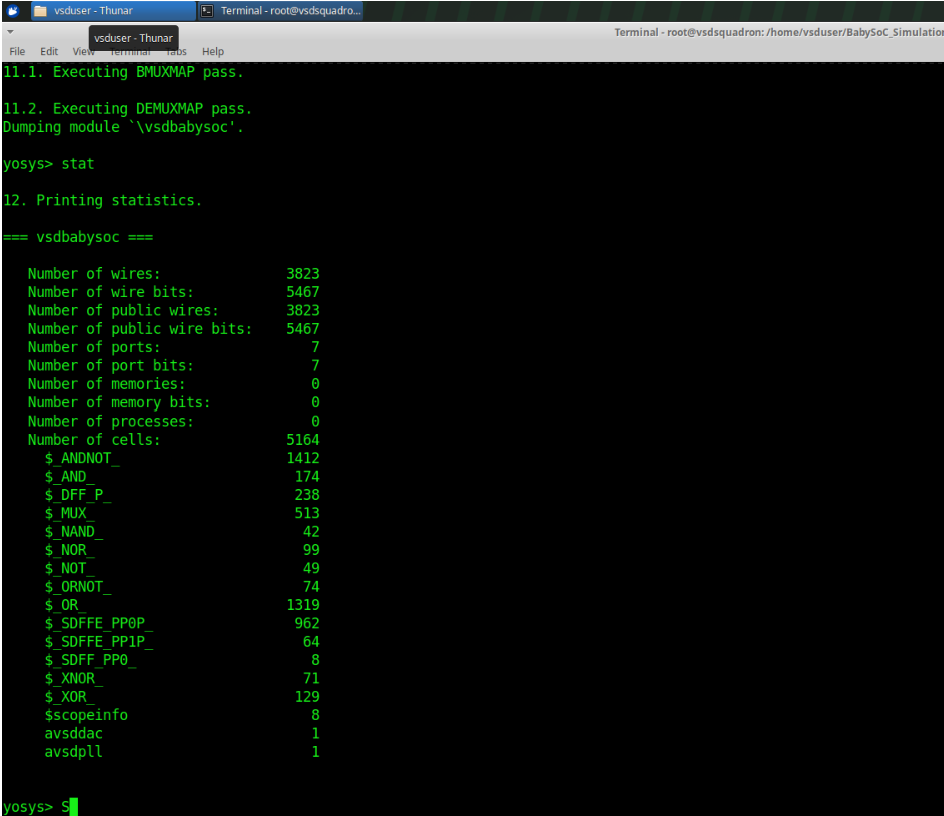
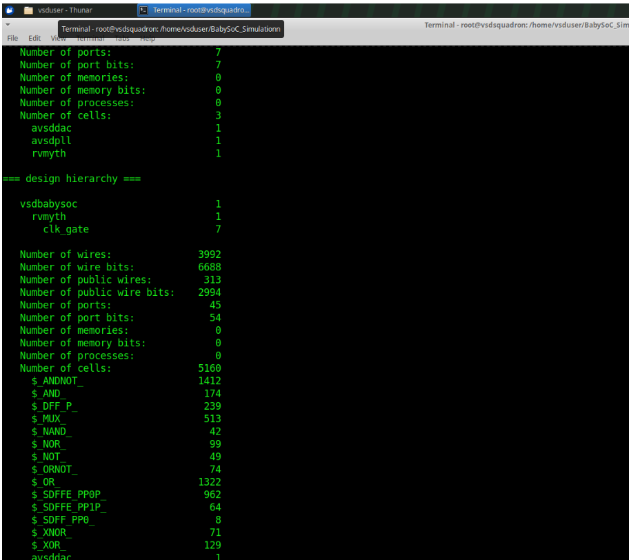
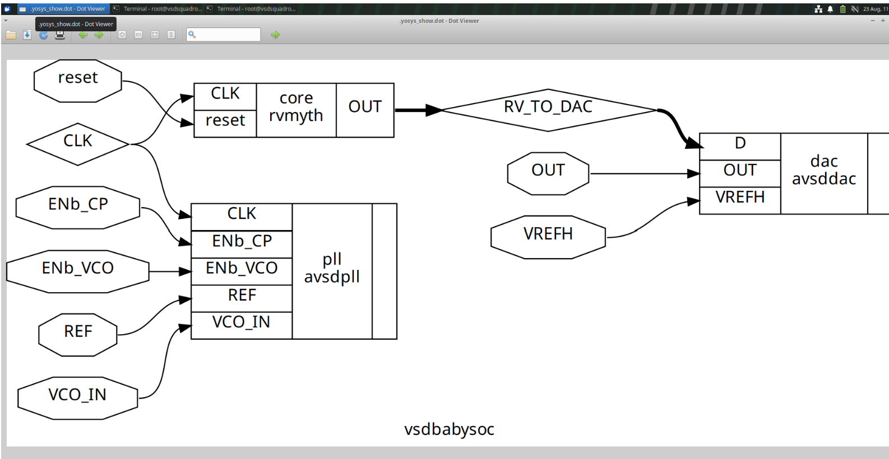
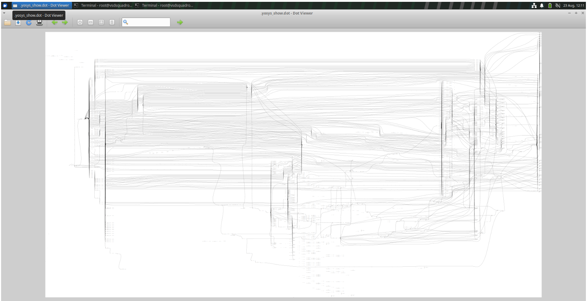
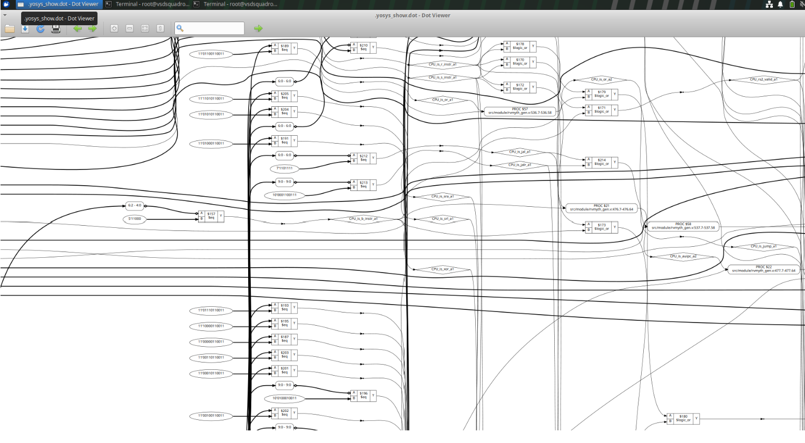
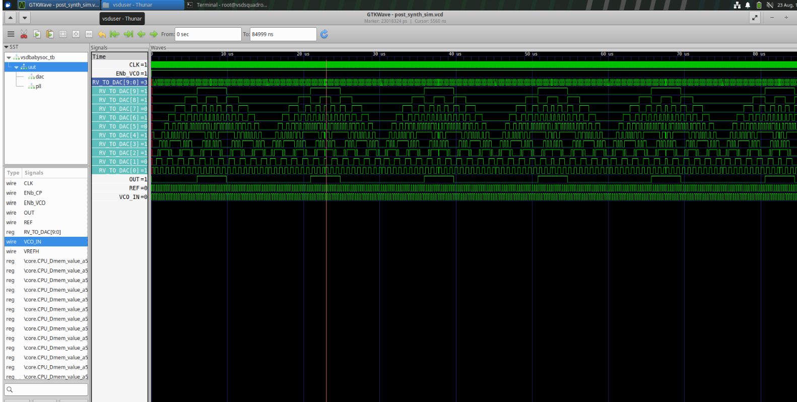

# VLSI RTL Design and Synthesis

This repository contains my hands-on work completed during the **VLSI RTL Design and Synthesis training**. The work covers RTL design, functional simulation, waveform analysis, logic synthesis, timing libraries, hierarchical design, sequential logic, logic optimization, Gate-Level Simulation (GLS), synthesis-oriented RTL coding, technology mapping, and synthesized hardware analysis using open-source EDA tools and the SKY130 standard-cell library.

The repository contains practical work from **Modules 1–5**, covering the complete RTL-to-hardware flow from Verilog RTL description and simulation to synthesis, optimization, technology mapping, and gate-level verification.

---

## Module 1 – Introduction to Verilog RTL Design and Synthesis

Module 1 introduced the fundamentals of Verilog RTL design, simulation, waveform analysis, and logic synthesis using open-source EDA tools. A 2:1 multiplexer was used as the primary design example to understand the RTL-to-netlist flow.

### Work Completed

* Introduction to RTL design using Verilog
* Understanding RTL design and testbench structure
* Combinational logic implementation
* Design of a 2:1 multiplexer
* Testbench development
* Functional simulation using Icarus Verilog
* VCD waveform generation
* Waveform analysis using GTKWave
* Introduction to Yosys
* Reading and analyzing Verilog RTL using Yosys
* Understanding the logic synthesis process
* Understanding `.lib` standard-cell libraries
* Introduction to PVT concepts
* SKY130 standard-cell library usage
* Technology mapping using ABC
* Synthesized netlist generation
* Gate-level netlist inspection
* Understanding RTL-to-netlist conversion

The overall flow covered RTL design, testbench creation, Icarus Verilog simulation, VCD generation, GTKWave waveform analysis, Yosys synthesis, SKY130 technology mapping, and gate-level netlist generation.

---

## Module 2 – Timing Libraries, Hierarchical Design and Sequential Logic

Module 2 focused on understanding how RTL descriptions are converted into technology-dependent hardware. The module introduced timing libraries, standard-cell information, hierarchical RTL design, sequential logic, asynchronous set/reset behavior, and synthesis of arithmetic circuits.

### Work Completed

* Understanding timing concepts
* Introduction to standard-cell libraries
* Understanding Liberty (`.lib`) files
* Studying standard-cell information
* Understanding timing characteristics of cells
* Understanding propagation delay
* Understanding setup and hold time
* Understanding clock-to-Q delay
* Understanding input transition and output load
* RTL-to-netlist conversion
* Yosys-based synthesis
* Hierarchical RTL design
* Creating and connecting submodules
* Understanding benefits of hierarchical design
* D Flip-Flop implementation
* Different Flip-Flop coding styles
* Asynchronous reset implementation
* Asynchronous set implementation
* Simulation of sequential circuits
* Waveform analysis of clock, data, set, reset, and output signals
* Mapping RTL flip-flops to standard cells
* Analysis of synthesized sequential structures
* Multiplier synthesis
* Technology mapping and synthesized hardware analysis

The module established the relationship between RTL code, timing libraries, hierarchical design, sequential logic, technology mapping, and synthesized standard-cell hardware.

---

## Module 3 – Combinational and Sequential Logic Optimization

Module 3 focused on the optimization techniques performed by synthesis tools on digital RTL designs. The practical experiments demonstrated how redundant expressions, constant values, unnecessary logic, and unused sequential elements can be simplified or removed while preserving the intended functionality.

### Work Completed

* Introduction to logic optimization
* Understanding the need for synthesis optimization
* Combinational logic optimization
* Boolean logic simplification
* Constant propagation
* Redundant logic removal
* Conditional logic simplification
* Optimization of nested conditional expressions
* Analysis of combinational RTL transformations
* Sequential logic optimization
* D Flip-Flop optimization
* Constant-driven Flip-Flop optimization
* Removal of unnecessary sequential logic
* Sequential constant propagation
* Analysis of register dependencies
* Counter optimization
* Analysis of unused counter bits
* Optimization of comparison logic
* RTL functional simulation
* Waveform verification
* Synthesis of optimized RTL
* Inspection of optimized synthesized circuits
* Comparison of RTL complexity with synthesized hardware complexity

The module demonstrated that synthesis tools do not blindly implement every RTL element. Instead, they analyze the logic and optimize hardware based on the required observable functionality.

---

## Module 4 – Gate-Level Simulation, Blocking vs Non-Blocking and Synthesis Simulation

Module 4 focused on RTL coding practices, simulation behavior, synthesis, and verification of synthesized hardware. The module examined different MUX coding styles, sensitivity-list issues, blocking and non-blocking assignments, and Gate-Level Simulation using synthesized netlists.

### Work Completed

* Different RTL coding styles for MUX implementation
* 2:1 MUX using conditional/ternary operators
* MUX implementation using combinational `always` blocks
* Understanding sensitivity lists
* Analysis of incomplete sensitivity lists
* Understanding simulation-modeling problems
* Correct combinational coding using `always @(*)`
* Introduction to `always_comb`
* Understanding blocking assignments
* Understanding non-blocking assignments
* Analysis of procedural execution order
* Understanding simulation ordering
* Blocking assignment examples
* Sequential coding using non-blocking assignments
* RTL functional simulation
* Logic synthesis using Yosys
* Gate-level netlist generation
* Technology mapping to SKY130 standard cells
* Introduction to Gate-Level Simulation (GLS)
* Post-synthesis netlist simulation
* Use of standard-cell functional models
* RTL versus GLS waveform comparison
* Verification of synthesized hardware
* Analysis of functional and timing differences between RTL and GLS

The module demonstrated the complete RTL-to-gate simulation flow: RTL creation, functional verification, synthesis, technology mapping, gate-level netlist generation, and simulation of the synthesized implementation.

---

## Module 5 – Optimization in Synthesis

Module 5 focused on how RTL coding styles influence the hardware generated during synthesis. The module explored incomplete conditional statements, latch inference, complete `case` statements, MUX and DEMUX implementations, `generate` constructs, and ripple-carry adder implementation.

### Work Completed

* Introduction to synthesis optimization
* Synthesis-oriented RTL coding
* Understanding combinational RTL description
* Incomplete `if` statements
* Incomplete `if-else` conditions
* Incomplete `case` statements
* Understanding latch inference
* Analysis of unintended storage behavior
* Correcting incomplete combinational logic
* Complete `case` statements
* Use of `default` branches
* Case-based MUX implementation
* MUX implementation using `generate`
* DEMUX implementation using `case`
* DEMUX implementation using `generate`
* Understanding repeated hardware structures
* Use of `generate` constructs
* Ripple-carry adder implementation
* Generation of repeated full-adder structures
* RTL simulation
* Synthesis using Yosys
* Synthesized hardware inspection
* Comparison of RTL coding styles
* Analysis of the effect of RTL coding style on inferred hardware

The module demonstrated that incomplete combinational assignments can lead to latch inference, while complete and unambiguous RTL descriptions help produce hardware that better matches the intended design.

---

## Overall Training Coverage

Across Modules 1–5, the training progressed through the complete digital design flow:

```text
RTL DESIGN
     |
     v
VERILOG CODING
     |
     v
TESTBENCH DEVELOPMENT
     |
     v
FUNCTIONAL SIMULATION
     |
     v
VCD GENERATION
     |
     v
GTKWAVE ANALYSIS
     |
     v
YOSYS SYNTHESIS
     |
     v
LOGIC OPTIMIZATION
     |
     v
TECHNOLOGY MAPPING
     |
     v
SKY130 STANDARD CELLS
     |
     v
GATE-LEVEL NETLIST
     |
     v
GATE-LEVEL SIMULATION
     |
     v
WAVEFORM VERIFICATION
```

### Key Tools and Technologies

* **Verilog** – RTL design and hardware description
* **Icarus Verilog** – Functional RTL simulation
* **GTKWave** – Waveform visualization and analysis
* **Yosys** – RTL synthesis and optimization
* **ABC** – Logic optimization and technology mapping
* **SKY130** – Open-source standard-cell technology
* **Liberty (`.lib`) files** – Standard-cell timing, area, power, and functional information

### Overall Learning Outcomes

The training provided practical understanding of:

* RTL design and coding
* Testbench development
* Functional simulation
* Waveform-based verification
* RTL-to-netlist conversion
* Standard-cell libraries
* Timing library concepts
* Hierarchical RTL design
* Sequential logic and Flip-Flops
* Asynchronous set and reset
* Combinational logic optimization
* Sequential logic optimization
* Synthesis-oriented coding practices
* Latch inference
* MUX and DEMUX implementation
* Generate-based hardware structures
* Ripple-carry adder design
* Technology mapping
* Synthesized netlist analysis
* Gate-Level Simulation
* RTL versus synthesized hardware verification

This training established a practical foundation for understanding how **Verilog RTL descriptions are transformed, optimized, mapped to standard-cell hardware, synthesized into gate-level netlists, and verified through simulation**.
VSDBabySoC – Integrated RTL-to-Gate-Level Verification

As an integrated practical exercise, the VSDBabySoC design was taken through pre-synthesis and post-synthesis verification.

# BabySoC – RTL to Post-Synthesis Gate-Level Verification

## Introduction

This project demonstrates the front-end ASIC design flow using a small RISC-V-based System-on-Chip called **BabySoC**.

The design is taken through multiple stages, starting from the RTL description and continuing through simulation, synthesis, SKY130 technology mapping, gate-level netlist generation, and post-synthesis verification.

The main objective is to verify that the synthesized hardware maintains the same intended functionality as the original RTL design.

---

# 1. BabySoC Design Overview

BabySoC is organized around three main hardware blocks inside the top-level `vsdbabysoc` module:

| Block       | Function                                                      |
| ----------- | ------------------------------------------------------------- |
| **RVMyth**  | RISC-V processor responsible for digital processing           |
| **AVSDPLL** | Generates the clock used by the processor                     |
| **AVSDDAC** | Converts the processor's digital output into an analog output |

The important signal path through the design is:

```text
Reference / PLL Control Signals
              │
              ▼
          AVSDPLL
              │
             CLK
              │
              ▼
           RVMyth
              │
        RV_TO_DAC[9:0]
              │
              ▼
          AVSDDAC
              │
             OUT
```

Block	Role
RVMyth	RISC-V based CPU core — the digital processing element of the SoC
AVSDPLL	On-chip PLL that generates the clock the CPU runs on
AVSDDAC	DAC that converts the CPU's digital output into an analog signal
Signal flow at a glance:

REF, VCO_IN, ENb_CP, ENb_VCO  ──►  AVSDPLL  ──► CLK ──┐
                                                        ▼
                                              reset ─► RVMyth (CPU)
                                                        │
                                                RV_TO_DAC[9:0]
                                                        ▼
                                      VREFH ─►    AVSDDAC   ─► OUT

### Design Hierarchy

```text
vsdbabysoc
├── avsddpll
├── rvmyth
└── avsddac
```


# 2. ASIC Design Flow

The BabySoC experiment follows the front-end portion of the ASIC design process.

```text
RTL Design
    ↓
Pre-Synthesis Simulation
    ↓
Logic Synthesis
    ↓
SKY130 Technology Mapping
    ↓
Gate-Level Netlist
    ↓
Post-Synthesis Simulation
    ↓
Static Timing Analysis
    ↓
Physical Design
```

The stages completed in this project are:

| Design Stage              | Status      |
| ------------------------- | ----------- |
| RTL Design                | ✅ Completed |
| Pre-Synthesis Simulation  | ✅ Completed |
| Yosys Synthesis           | ✅ Completed |
| SKY130 Technology Mapping | ✅ Completed |
| Gate-Level Netlist        | ✅ Completed |
| Post-Synthesis Simulation | ✅ Completed |
| Static Timing Analysis    | 🔜 Next     |
| Floorplanning             | ⏳ Upcoming  |
| Placement                 | ⏳ Upcoming  |
| Clock Tree Synthesis      | ⏳ Upcoming  |
| Routing                   | ⏳ Upcoming  |
| GDSII Generation          | ⏳ Upcoming  |


---

# 3. Pre-Synthesis Simulation

Before synthesis, the original RTL implementation was simulated to make sure that the BabySoC design was functioning correctly.

The simulation was performed using **Icarus Verilog**, and the resulting waveform was inspected with **GTKWave**.

The following signals were observed:

* `CLK`
* `REF`
* `reset`
* `VCO_IN`
* `VREFH`
* `RV_TO_DAC[9:0]`
* `OUT`

The purpose of this stage is to establish a reference behavior for the original RTL before converting it into gates.



# 4. Synthesis Using Yosys

Once the RTL behavior was verified, the design was synthesized using **Yosys**.

The BabySoC RTL was synthesized against the **SKY130 high-density standard-cell library**.

### Technology Library

```text
Library:
sky130_fd_sc_hd

Liberty:
sky130_fd_sc_hd__tt_025C_1v80.lib
```

During synthesis, different Yosys passes were used to transform the RTL into an optimized gate-level implementation.

| Yosys Operation     | Purpose                             |
| ------------------- | ----------------------------------- |
| `read_verilog`      | Reads the RTL source files          |
| `dfflibmap`         | Maps Flip-Flops to library cells    |
| `opt`               | Performs logic optimization         |
| `abc`               | Performs technology mapping         |
| `flatten`           | Combines the module hierarchy       |
| `setundef -zero`    | Resolves undefined signals          |
| `clean -purge`      | Removes unused logic                |
| `rename -enumerate` | Renames internal signals            |
| `write_verilog`     | Generates the final netlist         |
| `show`              | Produces a schematic representation |



# 5. Synthesis Statistics

After optimization, Yosys reports the hardware that remains in the synthesized design.

These statistics provide useful information about the amount and type of logic generated by the synthesis process.


---

# 6. SKY130 Technology Mapping

After the logical optimization stage, the design was mapped to cells available in the **SKY130 standard-cell library**.

At this point, the design changes from an RTL-level description into a technology-specific gate-level implementation.

Some of the mapped cells include:

```text
sky130_fd_sc_hd__nand2_1
sky130_fd_sc_hd__nor2_1
sky130_fd_sc_hd__and2_0
sky130_fd_sc_hd__mux2_1
sky130_fd_sc_hd__xor2_1
sky130_fd_sc_hd__dfrtp_1
```

The final design contains a large number of these standard-cell instances.

---

# 7. Technology-Mapped Netlist

The synthesized BabySoC can be inspected at different hierarchical levels.

## Top-Level BabySoC Netlist


---

## RVMyth CPU Netlist



---

## Expanded RVMyth Netlist



## Clock-Gating Netlist


These views make it possible to see how the original RTL hierarchy has been transformed into actual standard-cell based hardware.

---

# 8. Post-Synthesis Gate-Level Simulation

After generating the technology-mapped netlist, the synthesized design was simulated again.

This time, instead of simulating only the RTL, the simulation uses:

* Synthesized gate-level netlist
* SKY130 standard-cell Verilog models
* Original testbench
* Icarus Verilog

The simulation flow is:

```text
Gate-Level Netlist
        +
SKY130 Cell Models
        +
Testbench
        ↓
 Icarus Verilog
        ↓
 post_synth_sim.vcd
        ↓
    GTKWave
```

The simulation was performed using:

```text
-DPOST_SYNTH_SIM
-DFUNCTIONAL
-DUNIT_DELAY=#1



# 9. RTL vs Gate-Level Verification

The most important part of this experiment is comparing the behavior of the original RTL with the synthesized gate-level implementation.

The comparison focuses on:

* `CLK`
* `REF`
* `reset`
* `RV_TO_DAC[9:0]`
* `OUT`

The `RV_TO_DAC[9:0]` signal is particularly useful because it represents the digital information travelling from the processor toward the DAC.

If the synthesized implementation produces the same expected sequence as the RTL, it provides evidence that synthesis has preserved the intended functionality.

### 📷 IMAGE 14 – RTL Waveform

**Paste the pre-synthesis waveform again here if you want a direct comparison.**

```markdown

```


The matching behavior of the important signals demonstrates that the synthesized implementation continues to perform the intended function for the applied testbench.

---

# 10. Functional GLS vs Timing GLS

There are two important forms of Gate-Level Simulation.

### Functional Gate-Level Simulation

Functional GLS checks whether the synthesized gates perform the required logical operation.

This is the type of simulation performed in this project.

```text
RTL
 ↓
Synthesis
 ↓
Gate-Level Netlist
 ↓
Functional GLS
 ↓
Logical Verification
```

### Timing Gate-Level Simulation

Timing GLS additionally considers cell and interconnect delays.

It can therefore be used to investigate timing-related problems such as setup and hold violations.

The timing-related analysis is not part of the current stage and will be addressed later through **Static Timing Analysis (STA)**.

---

# 11. Tools and Technologies

The following tools and technologies were used during the BabySoC implementation:

| Tool / Technology  | Usage                               |
| ------------------ | ----------------------------------- |
| **Verilog HDL**    | RTL design                          |
| **Icarus Verilog** | RTL and gate-level simulation       |
| **GTKWave**        | Waveform analysis                   |
| **Yosys**          | Logic synthesis                     |
| **ABC**            | Technology mapping and optimization |
| **SKY130**         | Standard-cell technology            |
| **Liberty `.lib`** | Cell and timing information         |
| **Linux**          | Development environment             |

---

# 12. Current Status

The current BabySoC implementation has successfully progressed through:

```text
RTL Design
     ↓
Pre-Synthesis Simulation
     ↓
Yosys Synthesis
     ↓
SKY130 Technology Mapping
     ↓
Gate-Level Netlist
     ↓
Post-Synthesis Simulation
     ↓
Functional Verification
```

### Current Status

**RTL → Post-Synthesis Gate-Level Simulation ✅**

The next major stage is:

```text
Static Timing Analysis
        ↓
Floorplanning
        ↓
Placement
        ↓
Clock Tree Synthesis
        ↓
Routing
        ↓
Physical Verification
        ↓
GDSII
```

---

# 13. Key Learnings

Working through the BabySoC design provided several important practical insights.

### 1. Hierarchy Matters

Even a relatively small SoC contains multiple interconnected blocks. Understanding the relationships between the CPU, PLL, and DAC is important when debugging signals and interpreting simulation results.

### 2. Synthesis Performs Multiple Transformations

Synthesis is not simply a conversion from Verilog to gates. Different stages perform different jobs, such as sequential-cell mapping, optimization, and technology mapping.

### 3. Standard Cells Make the Hardware Concrete

After technology mapping, abstract RTL operations become actual SKY130 standard-cell instances. Inspecting the generated netlist gives a much clearer understanding of what hardware the RTL describes.

### 4. Simulation Before and After Synthesis Is Important

Pre-synthesis simulation establishes the expected RTL behavior. Post-synthesis simulation then checks whether the synthesized implementation continues to behave correctly.

### 5. Functional GLS Is Not the End of Verification

Functional gate-level simulation verifies logical behavior, but it does not provide complete timing closure. Timing analysis is required to determine whether the design satisfies its timing requirements.

---

# Conclusion

The BabySoC project demonstrates a practical portion of the ASIC front-end design flow, beginning with RTL and progressing through synthesis, optimization, technology mapping, and gate-level verification.

The project started with functional verification of the original RTL design. The design was then synthesized using Yosys and mapped to the SKY130 standard-cell library.

Finally, the generated gate-level netlist was simulated using SKY130 cell models and compared with the original RTL behavior.

The overall process can be summarized as:

```text
             BabySoC RTL
                  ↓
        Pre-Synthesis Simulation
                  ↓
             Yosys Synthesis
                  ↓
          Logic Optimization
                  ↓
        SKY130 Technology Mapping
                  ↓
          Gate-Level Netlist
                  ↓
       Post-Synthesis Simulation
                  ↓
        RTL vs GLS Comparison
                  ↓
       Functional Verification ✓
```

This experiment provides a practical understanding of how a digital SoC moves from an RTL description toward an implementation that can eventually proceed into physical design.

The next step in the flow is **Static Timing Analysis**, followed by the physical-design stages of floorplanning, placement, clock-tree synthesis, routing, physical verification, and finally GDSII generation.
